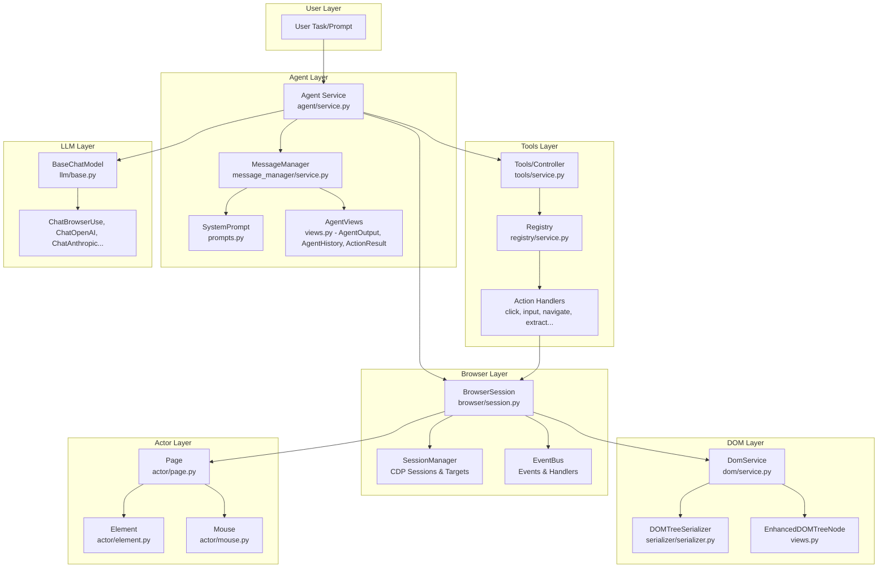
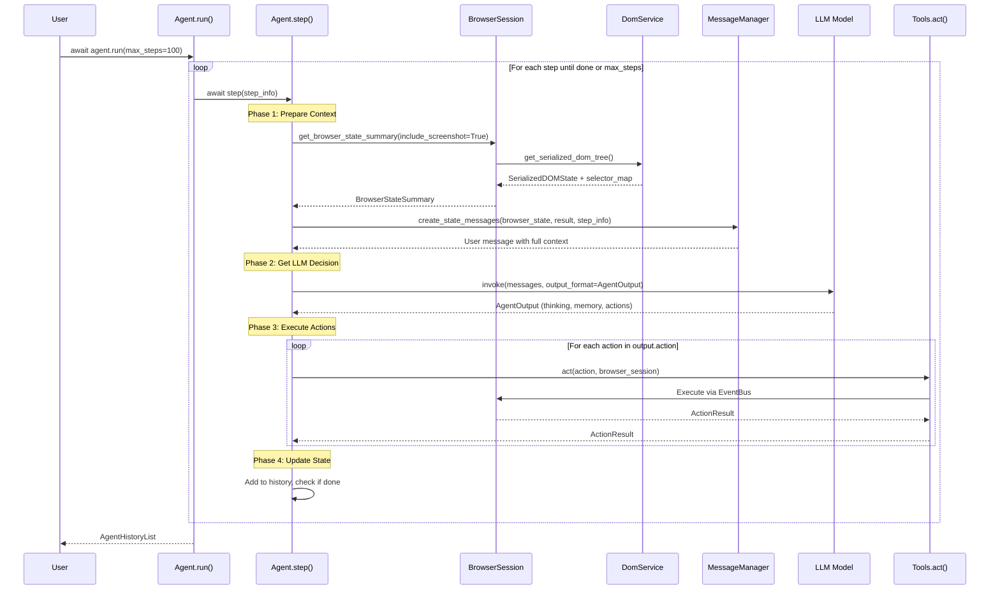
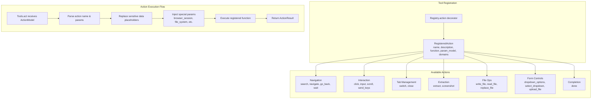
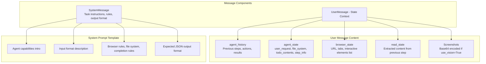
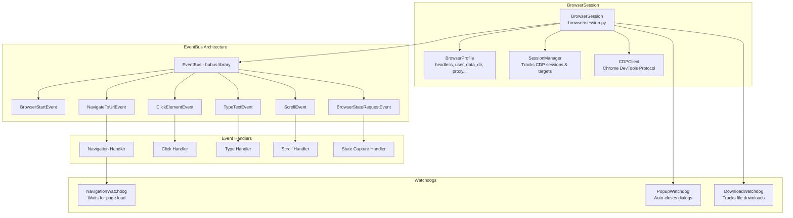
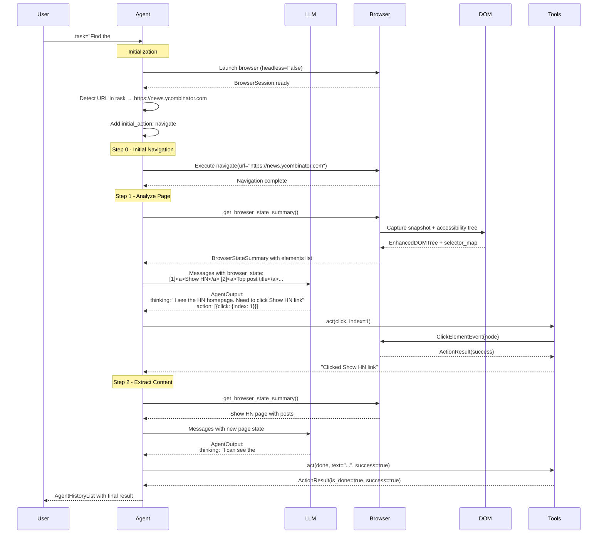
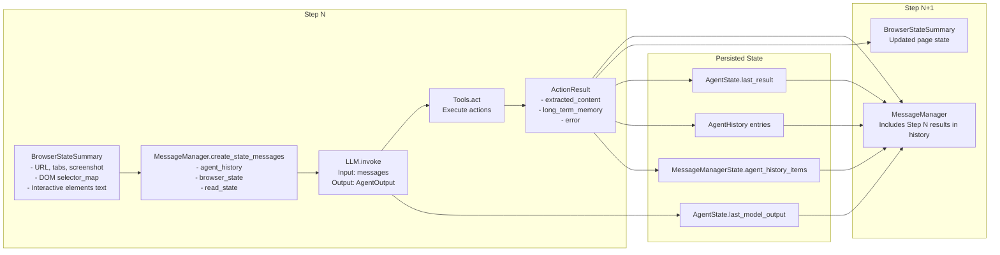

# Browser-Use: Complete Implementation Deep Dive

This document provides a comprehensive explanation of how Browser-Use is implemented, including architecture, data flow, and step-by-step execution details.

## Table of Contents

1. [High-Level Architecture Overview](#high-level-architecture-overview)
2. [Core Components](#core-components)
3. [The Agent Step Execution Flow](#the-agent-step-execution-flow)
4. [DOM Processing Pipeline](#dom-processing-pipeline)
5. [Tools & Action System](#tools--action-system)
6. [Message Building & LLM Context](#message-building--llm-context)
7. [Browser Session & Event System](#browser-session--event-system)
8. [Complete Example Walkthrough](#complete-example-walkthrough)
9. [Data Flow Between Steps](#data-flow-between-steps)
10. [Key Design Patterns](#key-design-patterns)

---

## High-Level Architecture Overview



---

## Core Components

### 1. Agent Service (`agent/service.py`)

The `Agent` class is the orchestrator that manages the entire automation loop.

**Key Responsibilities:**
- Receives user task and LLM configuration
- Runs iterative step loop until task completion
- Manages state, history, and error handling
- Coordinates between browser, tools, and LLM

**Key Fields:**

```python
class Agent:
    task: str                      # User's task description
    llm: BaseChatModel            # LLM for decision making
    browser_session: BrowserSession  # Browser control
    tools: Tools                  # Available actions
    state: AgentState             # Current state (step #, failures, results)
    history: AgentHistoryList     # Full execution history
    settings: AgentSettings       # Configuration (max_failures, use_vision, etc.)
```

### 2. Agent State & Output Models (`agent/views.py`)

**AgentOutput** - What the LLM returns each step:

```python
class AgentOutput(BaseModel):
    thinking: str | None           # Chain-of-thought reasoning
    evaluation_previous_goal: str  # Assessment of last action
    memory: str                    # What to remember for context
    next_goal: str                 # Immediate next objective
    action: list[ActionModel]      # Actions to execute (1-3)
```

**AgentHistory** - Record of each step:

```python
class AgentHistory(BaseModel):
    model_output: AgentOutput       # LLM's response
    result: list[ActionResult]      # Results from actions
    state: BrowserStateHistory      # Browser state at that step
    metadata: StepMetadata          # Timing info
```

**ActionResult** - Outcome of each action:

```python
class ActionResult(BaseModel):
    is_done: bool                   # Task completed?
    success: bool | None            # Was it successful?
    error: str | None               # Error message if failed
    extracted_content: str | None   # Data extracted
    long_term_memory: str | None    # Important info to persist
```

---

## The Agent Step Execution Flow



### Step Execution Details (`agent/service.py` lines 979-1006)

Each step has 4 phases:

```python
async def step(self, step_info: AgentStepInfo | None = None) -> None:
    """Execute one step of the task"""
    self.step_start_time = time.time()
    
    try:
        # Phase 1: Prepare context and timing
        browser_state_summary = await self._prepare_context(step_info)

        # Phase 2: Get model output and execute actions
        await self._get_next_action(browser_state_summary)
        await self._execute_actions()

        # Phase 3: Post-processing
        await self._post_process()

    except Exception as e:
        await self._handle_step_error(e)

    finally:
        await self._finalize(browser_state_summary)
```

---

## DOM Processing Pipeline

```mermaid
flowchart TB
    subgraph "CDP Calls (Parallel)"
        A1[DOMSnapshot.captureSnapshot]
        A2[DOM.getDocument]
        A3[Accessibility.getFullAXTree]
        A4[Page.getLayoutMetrics]
    end
    
    subgraph "Data Processing"
        B1[Build AX Tree Lookup<br/>backendDOMNodeId → AXNode]
        B2[Build Snapshot Lookup<br/>backendNodeId → SnapshotData]
        B3[Construct EnhancedDOMTreeNode<br/>Recursive tree building]
    end
    
    subgraph "Serialization"
        C1[DOMTreeSerializer.serialize_accessible_elements]
        C2[Filter interactive elements<br/>isClickable, isEditable, etc.]
        C3[Paint Order Filtering<br/>Remove hidden elements]
        C4[Generate LLM representation<br/>[index]<type>text</type>]
    end
    
    subgraph "Output"
        D1[SerializedDOMState]
        D2[selector_map: dict<br/>index → EnhancedDOMTreeNode]
        D3[LLM text representation]
    end
    
    A1 --> B2
    A2 --> B3
    A3 --> B1
    A4 --> B3
    
    B1 --> B3
    B2 --> B3
    
    B3 --> C1
    C1 --> C2
    C2 --> C3
    C3 --> C4
    
    C4 --> D1
    C4 --> D2
    C4 --> D3
```

### DOM Service (`dom/service.py`)

**Key functionality:**

1. **Captures full page state** via CDP (Chrome DevTools Protocol):
   - `DOMSnapshot.captureSnapshot` - Element bounds, styles, paint order
   - `DOM.getDocument` - Full DOM tree structure
   - `Accessibility.getFullAXTree` - Accessibility tree (labels, roles)

2. **Builds EnhancedDOMTreeNode** - Enriched DOM nodes with:
   - Backend node ID (for CDP commands)
   - Accessibility info (name, role, description)
   - Computed styles and visibility
   - Absolute position (accounts for iframes, scroll)
   - Element hash for stable identification

3. **Serializes for LLM** - Converts to indexed text format:

```
[33]<div>User form</div>
  *[35]<button aria-label='Submit form'>Submit</button>
  [36]<input name='email' placeholder='Enter email'/>
```

---

## Tools & Action System



### Tools Service (`tools/service.py`)

The `Tools` class registers and executes all browser actions.

**Action Registration Pattern:**

```python
@self.registry.action(
    'Click element by index.',
    param_model=ClickElementAction,
)
async def click(params: ClickElementAction, browser_session: BrowserSession):
    node = await browser_session.get_element_by_index(params.index)
    event = browser_session.event_bus.dispatch(ClickElementEvent(node=node))
    await event
    return ActionResult(extracted_content=f'Clicked {element_desc}')
```

**Available Actions:**

| Category | Actions |
|----------|---------|
| Navigation | `search`, `navigate`, `go_back`, `wait` |
| Interaction | `click`, `input`, `scroll`, `send_keys` |
| Tab Management | `switch`, `close` |
| Extraction | `extract`, `screenshot` |
| File Ops | `write_file`, `read_file`, `replace_file` |
| Form Controls | `dropdown_options`, `select_dropdown`, `upload_file` |
| Completion | `done` |

**Action Execution (`tools/service.py` lines 1417-1481):**

```python
async def act(self, action: ActionModel, browser_session: BrowserSession, ...) -> ActionResult:
    for action_name, params in action.model_dump(exclude_unset=True).items():
        if params is not None:
            result = await self.registry.execute_action(
                action_name=action_name,
                params=params,
                browser_session=browser_session,
                page_extraction_llm=page_extraction_llm,
                file_system=file_system,
                sensitive_data=sensitive_data,
                available_file_paths=available_file_paths,
            )
            return result
```

---

## Message Building & LLM Context



### MessageManager (`agent/message_manager/service.py`)

Builds the context sent to the LLM each step.

**Message Structure:**

1. **SystemMessage** - Instructions loaded from `system_prompt.md`:
   - Agent capabilities
   - Input format explanation
   - Browser rules & best practices
   - File system usage
   - Task completion rules
   - Expected JSON output format

2. **UserMessage** - Current state context:

```xml
<agent_history>
Step 1: Eval: Success | Memory: Navigated to site | Goal: Click search
Step 2: Eval: Success | Memory: Found input field | Goal: Type query
</agent_history>

<agent_state>
<user_request>Search for "AI news" on Google</user_request>
<file_system>todo.md (12 bytes), results.md (0 bytes)</file_system>
<step_info>Step 3 / max 100 | Today: 2025-01-15</step_info>
</agent_state>

<browser_state>
Current tab: abc1
Interactive elements:
[1]<input aria-label='Search'>Search Google</input>
[2]<button>Google Search</button>
</browser_state>
```

---

## Browser Session & Event System



### BrowserSession (`browser/session.py`)

Event-driven browser control with CDP.

**Key Components:**
- **BrowserProfile** - Configuration (headless, proxy, downloads_path, allowed_domains)
- **SessionManager** - Tracks CDP sessions per target (tab/iframe)
- **CDPClient** - Direct Chrome DevTools Protocol access
- **EventBus** - Decoupled event handling (from `bubus` library)

**Event Flow for Click:**

```python
# 1. Action requests click
event = browser_session.event_bus.dispatch(
    ClickElementEvent(node=element_node)
)
await event

# 2. Handler scrolls element into view, highlights, clicks
# 3. Returns metadata (click coordinates, success)
click_metadata = await event.event_result()
```

---

## Complete Example Walkthrough

**Task: "Find the #1 post on Show HN"**



---

## Data Flow Between Steps



---

## Key Design Patterns

### 1. Pydantic Models Everywhere

All data structures use Pydantic v2 for validation:
- `AgentOutput`, `ActionResult`, `AgentHistory` - Agent data
- `EnhancedDOMTreeNode`, `BrowserStateSummary` - Browser data
- Action parameter models (e.g., `ClickElementAction`, `NavigateAction`)

### 2. Event-Driven Browser Control

Actions dispatch events through `EventBus`:

```python
event = browser_session.event_bus.dispatch(ClickElementEvent(node=node))
await event
result = await event.event_result()
```

### 3. Registry Pattern for Actions

Actions are registered with decorators and dynamically composed:

```python
@self.registry.action('Click element by index.', param_model=ClickElementAction)
async def click(params, browser_session): ...
```

### 4. Selector Map for Element Targeting

Interactive elements get numeric indices:

```python
selector_map: dict[int, EnhancedDOMTreeNode] = {
    1: <button element>,
    2: <input element>,
    # ...
}
# LLM sees: [1]<button>Submit</button>
# Action uses: click(index=1)
```

### 5. History for Context & Replay

Full execution history enables:
- Context for LLM (what was tried, what worked)
- Replay/rerun functionality with variable substitution
- Debugging and analysis

---

## File Structure Reference

```
browser_use/
├── agent/
│   ├── service.py              # Main Agent class and step execution
│   ├── views.py                # AgentOutput, AgentHistory, ActionResult models
│   ├── prompts.py              # SystemPrompt and AgentMessagePrompt builders
│   ├── message_manager/
│   │   ├── service.py          # MessageManager for LLM context building
│   │   └── views.py            # MessageManagerState, HistoryItem
│   └── system_prompts/
│       ├── system_prompt.md    # Default system prompt template
│       └── system_prompt_flash.md  # Simplified prompt for fast mode
├── browser/
│   ├── session.py              # BrowserSession, CDPSession, Target, SessionManager
│   ├── profile.py              # BrowserProfile configuration
│   ├── events.py               # All browser events (Click, Navigate, Type, etc.)
│   └── views.py                # BrowserStateSummary, TabInfo
├── dom/
│   ├── service.py              # DomService for CDP-based DOM capture
│   ├── views.py                # EnhancedDOMTreeNode, SerializedDOMState
│   └── serializer/
│       └── serializer.py       # DOMTreeSerializer for LLM representation
├── tools/
│   ├── service.py              # Tools class with all action implementations
│   ├── views.py                # Action parameter models (ClickAction, etc.)
│   └── registry/
│       ├── service.py          # Registry for action registration/execution
│       └── views.py            # RegisteredAction, ActionRegistry
├── actor/
│   ├── page.py                 # Page class for page-level operations
│   ├── element.py              # Element class for element interactions
│   └── mouse.py                # Mouse class for coordinate-based actions
├── llm/
│   ├── base.py                 # BaseChatModel abstract interface
│   └── [provider]/             # Provider implementations (openai, anthropic, etc.)
└── __init__.py                 # Public exports (Agent, Browser, Tools, etc.)
```

---

## Summary

Browser-Use implements a sophisticated **agent loop** that:

1. **Captures browser state** via CDP (DOM, accessibility, screenshots)
2. **Serializes for LLM** with indexed interactive elements
3. **Sends context to LLM** (system prompt + current state + history)
4. **Receives structured actions** (AgentOutput with thinking + actions)
5. **Executes actions** via event-driven browser control
6. **Updates state** and repeats until `done` action or max_steps

The architecture cleanly separates concerns:
- **Agent** - Orchestration and control flow
- **Tools** - Action registration and execution
- **Browser** - CDP communication and events
- **DOM** - Page state capture and serialization
- **LLM** - Decision making

This enables the agent to autonomously navigate websites, fill forms, extract data, and complete complex multi-step tasks using natural language instructions.
